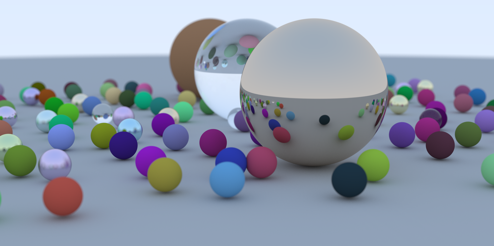
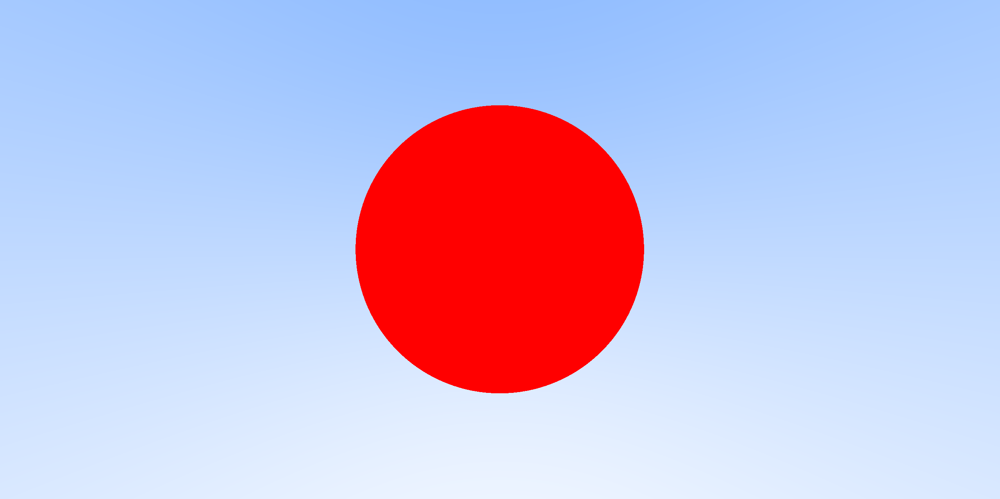
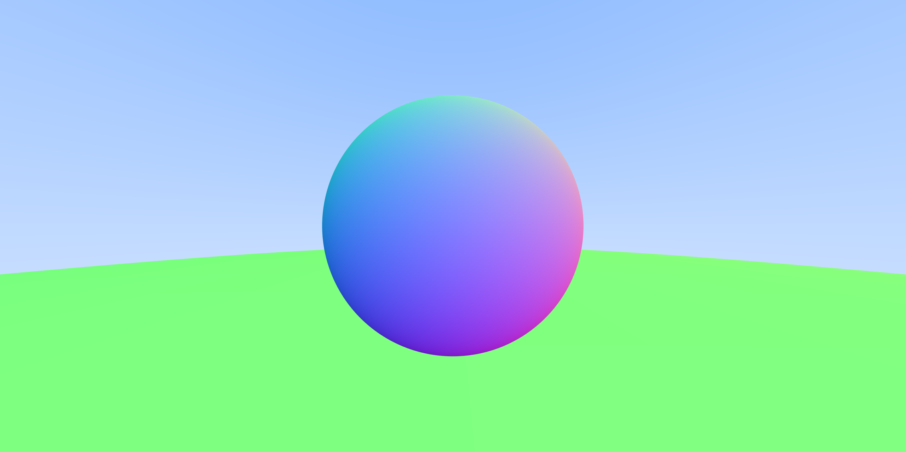
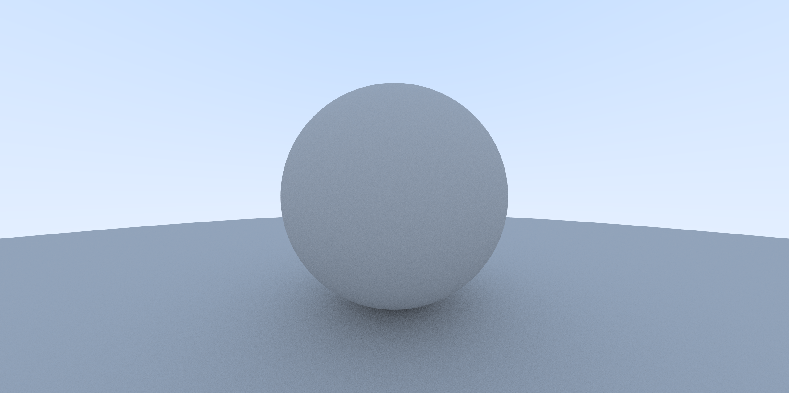
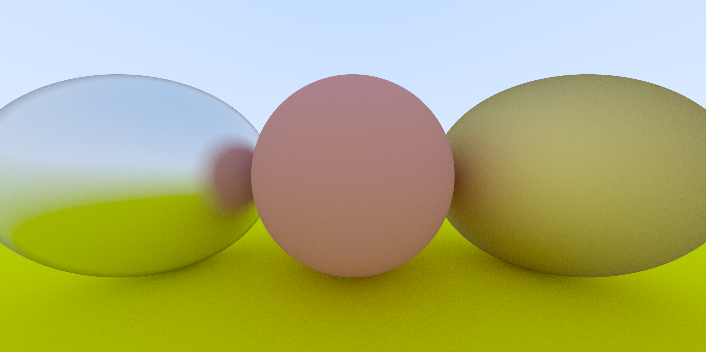
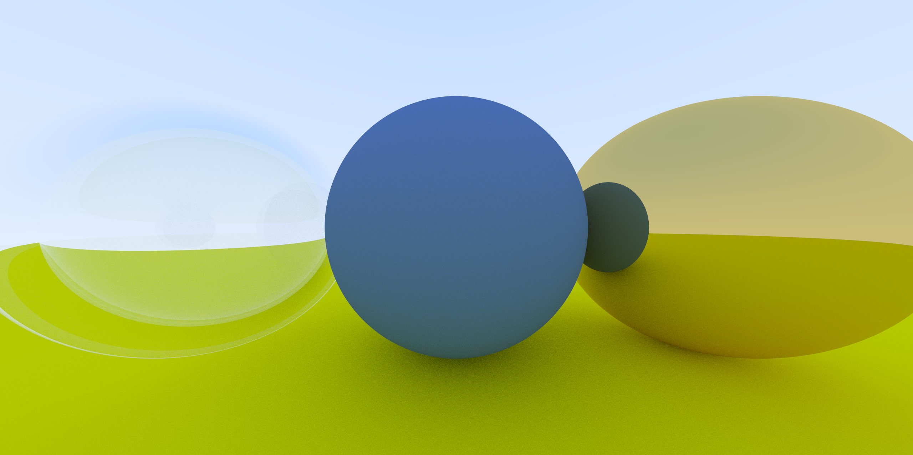
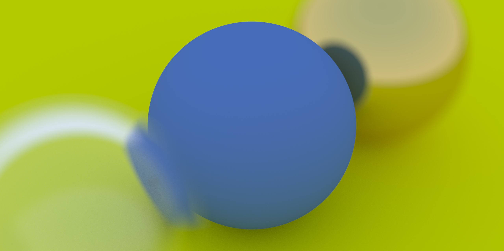
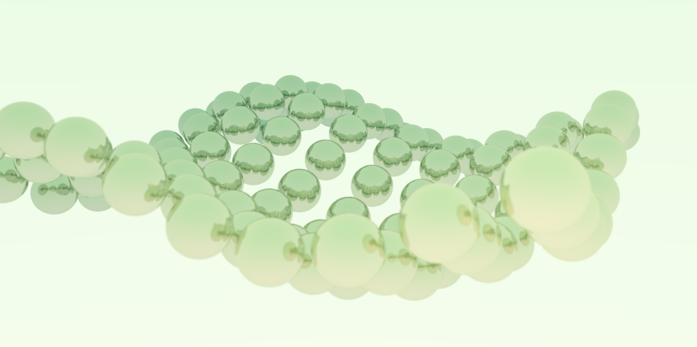

# Ray Tracing in One Weekend - GLSL Shadertoy

COSC 277 Computer Graphics: Programming Assignment 6

A GLSL adaptation of [_Ray Tracing in One Weekend_](https://raytracing.github.io/books/RayTracingInOneWeekend.html).

## Introduction

The GLSL source codes are meant to be run in VSCode using [Shader Toy plugin](https://marketplace.visualstudio.com/items?itemName=stevensona.shader-toy). To adapt the codes to [shadertoy.com](shadertoy.com), the following changes have to be made.

* Replace `void main()` with `void mainImage(out vec4 fragColor, in vec2 fragCoord)`
* Replace `gl_FragColor` with `fragColor`
* Replace `gl_FragCoord` with `fragCoord`

 ## TASK 1: Setup

 ## TASK 2: Adding a Sphere

 ## TASK 3: Surface Normals

 ## TASK 4: Antialiasing

 ## TASK 5: Diffuse Materials

 ## TASK 6: Metal

 ## TASK 7: Dielectrics

 ## TASK 8: Positionable Camera

 ## TASK 9: Defocus Blur

 ## TASK 10: Progressive Rendering

 ## TASK 11: Recreate Cover Image

 ## TASK 12: Interesting Scene
